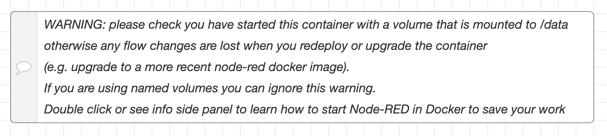
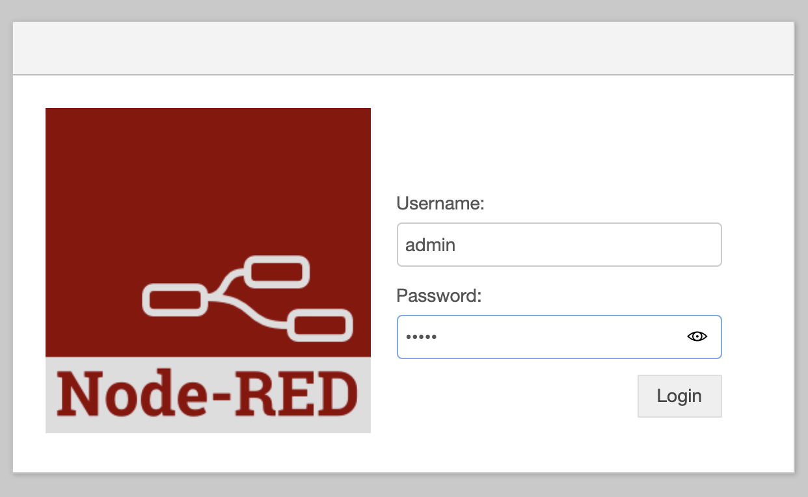

# Appkata-Node-RED

Bringing Node-RED to your Fly applications

<!---- cut here --->

## Rationale

If you are looking for a quick way to interconnect your various applications then Node-RED may be the low code option you've been looking for. Node-RED began its life as a way of putting together Internet Of Things applications, modeling systems as a flow of events which entered through an input node, passed through processing nodes, and eventually arrived at an output node or nodes. 

For example, an MQTT event could arrive through an MQTT node, be passed through some processing nodes, and be output as a new record in a database or forwarded to another messaging system. If that sounds complex, Node-RED visualizes these flows as an interactive graph you can manipulate.

But enough about Node-RED, you can [install it and try it locally]((https://nodered.org/docs/getting-started/local)) yourself. We're here today to show you how to launch Node-RED on Fly. And in the process, how to refine an application on Fly for best fit.

## Preparing

The first thing to do is to [install Node-RED locally](https://nodered.org/docs/getting-started/local), as there are some command-line operations we'll need later.

## Initialising

The simplest way to get up and running with Node-RED on Fly is to use the nodered/node-red docker image. You can do this in one line:

```cmd
fly init appkata-node-red --image nodered/node-red --port 1880 --org personal
```
```out
Selected App Name: appkata-node-red


New app created
  Name         = appkata-node-red
  Organization = personal
  Version      = 0
  Status       =
  Hostname     = <empty>

App will initially deploy to lhr (London, United Kingdom) region

Wrote config file fly.toml
```

The port is set to 1880 because that's the default port for Node-RED to communicate on. Take a note of where the application says it will initially deploy to too. 

We can deploy this app right now with:

```
fly deploy
```

and we can open the app with:

```
fly open
```

Thanks to Fly's edge network, your connection will be upgraded automatically to HTTPS and you'll be talking to Node-RED. Or at least observing this warning:



## Volumes

What that error is about is that the /data directory in the Node-RED image doesn't have isn't writable. We need to give our application a writable, persistent storage space, which is where Fly volumes come in. We can create a volume, local to our application, and get Fly to mount it on /data. First step in that process is to create a volume with a name:

```cmd
fly vol create node_red_data --region lhr
```
```out
fly vol create node_red_data --region lhr

        ID: bjR5jQjvZwNYVCVDxX9R
      Name: node_red_data
    Region: lhr
   Size GB: 10
Created at: 25 Nov 20 11:03 UTC
```

That region setting comes from when we inited the app earlier; it was going to deploy in lhr, so we've made the volume in lhr. The second part of this process is to tell the app about this new volume. For that we edit the `fly.toml` file and where we see:

```toml
[build]
  image = "nodered/node-red"
```

we add, after it:

```toml
[[mounts]]
source="node_red_data"
destination="/data"
```

This tells Fly that the volume named `node_red_data` should be mounted on the `/data` directory. With that in place, we can `fly deploy` and `fly open` our app. There's no warning and Node-RED flows are safe over redeploys.

There's only one problem...

## Securing Node-RED

You may have noticed that there's no password authentication when we connect to Node-RED. There is an option to turn it on in the Node-RED settings.js file, but that file is notionally on the /data volume. How can we get a file there with our settings?

Let's get the settings.js file first. You can find the default settings file [in the Node-Red repository](https://raw.githubusercontent.com/node-red/node-red/master/packages/node_modules/node-red/settings.js). Download that and save it as `settings.js`.

Next, we take control of the build process.

### Switching to a Dockerfile

This is where Fly's flexibility comes into play. We can switch deployment from just deploying an image to using a Dockerfile to create our own image. We'll create a Dockerfile to reproduce what we're currently doing first:

```
FROM nodered/node-red
```

And then tell Fly to use the Dockerfile by removing the `[build]` instruction from `fly.toml`, deleting or commenting out the part that reads:

```
[build]
  image = "nodered/node-red"
```

If we now run `fly deploy` you'll see this instruction being run and the app deploy as it previously did.

### Customizing Startup

When images startup, they have a command to be run and its that command we want to take over. The Node-RED image calls npm to start the Node-RED service like so:

```
npm start --cache /data/.npm -- --userDir /data
```

We'll add this command to the end of a short script which will copy our `settings.js` file over to /data/ before we start up Node-RED. This can all go in a script called `entrypoint.sh`.

```
#!/bin/bash

cp /etc/settings.js /data/settings.js

npm start --cache /data/.npm -- --userDir /data
```

But wait! How did settings.js get there and how are we going to run this script? Back to our Dockerfile, to ask it to do that work. Let's add this to the Dockerfile and:

```
COPY settings.js /etc/settings.js

USER root

COPY entrypoint.sh /
RUN chmod +x /entrypoint.sh

USER node-red

ENTRYPOINT ["/entrypoint.sh"]
```

So, step by step:
* We copy the settings.js file into the image we are creating
* We switch to the root user
* We then copy the entrypoint.sh script to the file system root
* And we make it executable
* Then we switch back to the node-red user
* And set our entrypoint to this image to our entrypoint script.

Two little details to know: One is that the Node-RED Docker image switches to a `node-red` user as its last act, which is why we do the user switcheroo. The other is that yes, if our script was already executable, then it would be executable in the image. But just in case, and because invisible effects are invisible, we explicitly set the script to executable.

Now we can `fly deploy` and `fly open` the app again.

And everything is exactly the same! Which isn't surprising because we haven't changed the `settings.js` file so it's all still running of defaults.

### Adding a Password

Open up the `settings.js` file and find the "Securing Node-RED" section. You'll see an example of what we need to add immediatly below that: it's an `adminAuth` object.

Add to the file a section that should look like this:

```javascript
    adminAuth: {
       type: "credentials",
       users: [{
           username: "admin",
           password: "hashedpassword",
           permissions: "*"
       }]
    },
```

This will create us an admin user, but now we need to generate a hashed version of the password. If you installed Node-Red at the start of this example, it'll be easy. Just run `node-red admin hash-pw` and enter your password when prompted. It'll return a string which you should copy in where `hashedpassword` appears above.

Now we can `fly deploy` and `fly open` and be greeted with:



Now we can login as admin and the password we set and we've secured access to our Node-RED.

## Notes

We've put together a deployable Node-RED image for Fly. In the process, we've seen how we can take control of existing images and supplement their build process to add in functionality, and how we can use scripts to take over the startup of an image to make modifications we want in place. 

For Node-RED administration, editing the `setting.js` file locally and deploying will update our installed settings, so you can explore all the optional controls. For Node-RED usage, think of it as a graphically configurable glue layer within your system. You can install many of the third party nodes available and plug into many more applications and platforms.

## Discuss


* You can discuss this example on the [community.fly.io](https://community.fly.io/t/gogs-standalone-git-service-as-a-fly-example/358) topic.


